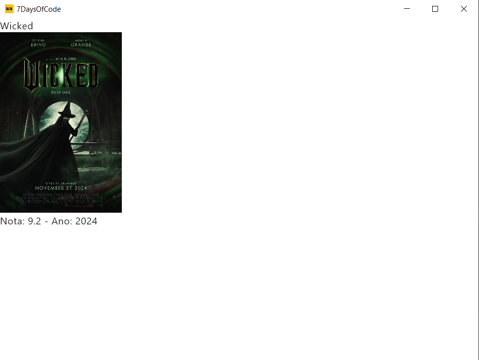
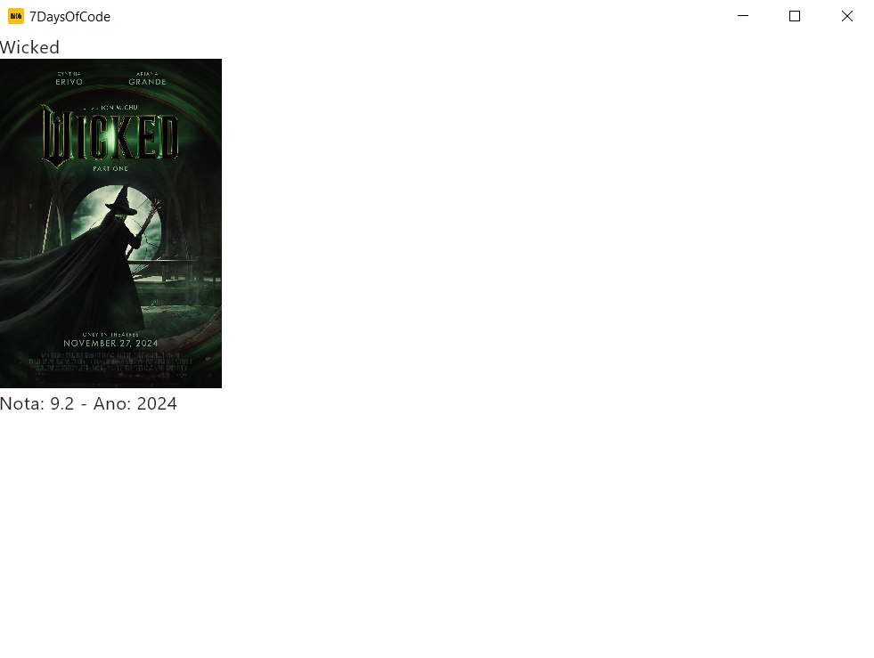
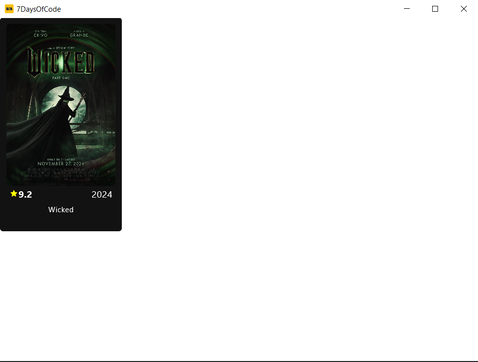

# 7DaysOfCode

Construção de uma aplicação desktop desenvolvida inteiramente em Kotlin, que oferece uma interface amigável para visualizar os 250 principais filmes do IMDb. A aplicação se conecta a uma API para obter a lista dos 250 principais filmes do IMDb, retornando os resultados em formato JSON. Utiliza Jetpack Compose para criar uma interface.

## Screenshots

### Day 1

### Day 2

### Day 3

### Day 4

### Day 5

### Day 6

### Day 7

## Thanks

- https://github.com/succlz123/compose-desktop-imageloader/

## Disclaimer

This project is for educational purposes only. It is not intended to be a commercial product and no profit is being made
from its development.
